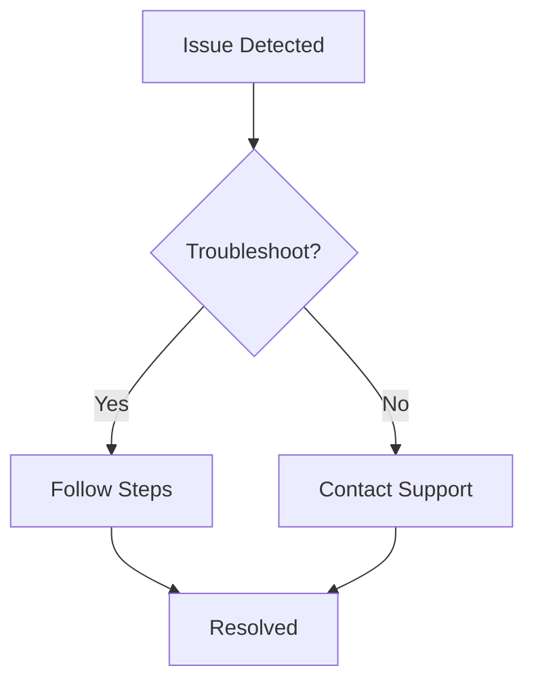

## Troubleshooting Access Issues

Access problems often stem from authentication or network configurations. Follow these structured steps to resolve them quickly.

<Steps>
  <Step title="Verify Credentials" icon="key">
    Check your `username` and `password` in the login form. Ensure you use the correct environment URL, such as `https://app.janekunon.com`.
  </Step>
  <Step title="Clear Browser Cache" icon="trash-2">
    Open your browser's developer tools and clear cache and cookies for the Janek Unon domain.

    ```bash
    # For Chrome: Ctrl+Shift+Delete
    ```
  </Step>
  <Step title="Check Network" icon="wifi">
    Test connectivity by pinging `api.janekunon.com`. If blocked, contact your network admin.
  </Step>
  <Step title="Reset Password" icon="refresh-cw">
    Visit `https://app.janekunon.com/reset` and follow the email instructions.
  </Step>
</Steps>

<Callout kind="tip">
  Enable two-factor authentication (2FA) after resolving access to enhance security.
</Callout>

## Collaboration Best Practices

Collaborate seamlessly by following these tips tailored to your platform.

<Tabs>
  <Tab title="Web" icon="globe">
    Share workspaces via the `Share` button. Invite team members with `editor` or `viewer` roles.

    <Image
      src="https://example.com/share-workspace.png"
      alt="Sharing a workspace in Janek Unon web app"
      width="800"
      height="400"
    />
  </Tab>
  <Tab title="Desktop App" icon="monitor">
    Use the desktop sync feature for offline editing. Changes sync automatically upon reconnection.

    ```javascript
    // Enable sync in settings
    const settings = {
      syncEnabled: true,
      autoSyncInterval: 30000 // 30 seconds
    };
    ```
  </Tab>
  <Tab title="Mobile" icon="smartphone">
    Tap the collaboration icon to join live sessions. Real-time updates appear instantly.
  </Tab>
</Tabs>

## Data Migration Guide

Migrate your data to Janek Unon using these multi-language examples.

<CodeGroup tabs="JavaScript,Python">
  ```javascript
  // Export from old system
  const fs = require('fs');
  const data = await fetch('https://old-api.com/export');
  fs.writeFileSync('backup.json', JSON.stringify(data));

  // Import to Janek Unon
  await fetch('https://api.janekunon.com/v1/import', {
    method: 'POST',
    headers: { 'Authorization': `Bearer YOUR_API_KEY` },
    body: JSON.stringify(data)
  });
  ```
  ```python
  import requests
  import json

  # Export
  response = requests.get('https://old-api.com/export')
  with open('backup.json', 'w') as f:
      json.dump(response.json(), f)

  # Import
  with open('backup.json', 'r') as f:
      data = json.load(f)
  requests.post('https://api.janekunon.com/v1/import',
                headers={'Authorization': 'Bearer YOUR_API_KEY'},
                json=data)
  ```
</CodeGroup>

<Callout kind="alert" default-open="true">
  Always create a full backup before migration. Test imports on a staging workspace first.
</Callout>

## Quick Navigation to More Help

<Columns cols={3}>
  <Card title="Account Settings" icon="settings" href="/docs/account">
    Manage users, roles, and billing.
  </Card>
  <Card title="API Reference" icon="code" href="/docs/api">
    Integrate with custom scripts.
  </Card>
  <Card title="Support Contact" icon="mail" href="mailto:support@janekunon.com" target="_blank">
    Reach our team for personalized help.
  </Card>
</Columns>

## Advanced FAQs

<ExpandableGroup>
  <Expandable title="How do I handle large file uploads?">
    Use chunked uploads for files `>100MB`. The API endpoint is `/v1/upload/chunked`.

    ```bash
    curl -X POST https://api.janekunon.com/v1/upload/chunked \
      -H "Authorization: Bearer YOUR_API_KEY" \
      -F "chunk=@file.part1"
    ```
  </Expandable>
  <Expandable title="What are workspace limits?">
    Free tier: 5GB storage, 10 collaborators. Upgrade for unlimited access.
  </Expandable>
  <Expandable title="Can I export all data?">
    Yes, use the bulk export tool under `Admin > Exports`. Supports CSV and JSON formats.
  </Expandable>
</ExpandableGroup>



These solutions cover the most common scenarios. Review logs in your dashboard for specific error codes like `401 Unauthorized` or `429 Rate Limit`.