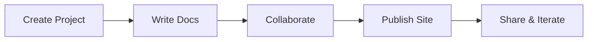

## Overview

Janek Unon provides a centralized space to create, organize, and publish your project documentation. You build structured docs with Markdown and MDX support, collaborate with your team, and deploy customized sites effortlessly. Whether you document APIs, user guides, or internal wikis, Janek Unon scales with your needs.

<Callout kind="info">
Janek Unon uses MDX for interactive components like tabs, steps, and cards, making your docs engaging and user-friendly.
</Callout>

## Key Benefits

Janek Unon stands out with its intuitive interface and powerful features. You gain full control over your documentation workflow without managing servers or builds.

<Columns cols={3}>
  <Card title="Fast Setup" icon="zap" href="/docs/quickstart">
    Launch your docs site in minutes. Import from GitHub, GitLab, or start from templates.
  </Card>
  <Card title="Team Collaboration" icon="users" href="/docs/collaboration">
    Invite contributors, review changes, and merge updates seamlessly.
  </Card>
  <Card title="Customizable Themes" icon="palette" href="/docs/customization">
    Apply your brand colors like `#3B82F6` and custom layouts.
  </Card>
</Columns>

## Getting Oriented

Start by exploring the dashboard. You access projects, edit pages, and preview changes in real-time.

<Steps>
  <Step title="Create a Project" icon="plus">
    Click **New Project** and select a template or import your repo.
  </Step>
  <Step title="Add Documentation" icon="file-text">
    Create pages using Markdown or MDX. Use components for rich content.
  </Step>
  <Step title="Publish" icon="globe">
    Deploy with one click. Share your live site via custom domains.
  </Step>
</Steps>

### Platform-Specific Onboarding

<Tabs>
  <Tab title="Web Editor" icon="browser">
    Edit directly in the browser. No local setup required.

    ```javascript
    // Example MDX page structure
    import { Callout } from 'components';

    <Callout kind="tip">
      Start writing here.
    </Callout>
    ```
  </Tab>
  <Tab title="CLI Integration" icon="terminal">
    Use the CLI for local development.

    <CodeGroup tabs="npm,yarn">
    ```bash
    npm install -g @janek-unon/cli
    janek init my-docs
    ```
    ```bash
    yarn global add @janek-unon/cli
    janek init my-docs
    ```
    </CodeGroup>
  </Tab>
  <Tab title="API Access" icon="api">
    Integrate programmatically.

    ```javascript
    const response = await fetch('https://api.janek-unon.com/projects', {
      headers: {
        Authorization: `Bearer ${YOUR_API_KEY}`
      }
    });
    const projects = await response.json();
    ```
  </Tab>
</Tabs>

## Next Steps and FAQs

<ExpandableGroup>
  <Expandable title="How do I customize my docs site?">
    Edit the theme in project settings. Apply your brand color `#3B82F6` and upload logos.
  </Expandable>
  <Expandable title="What about version control?">
    Connect to GitHub for automatic syncs. Every change triggers a preview build.
  </Expandable>
</ExpandableGroup>



You now have the foundation to build comprehensive documentation. Dive into specific guides for advanced features.