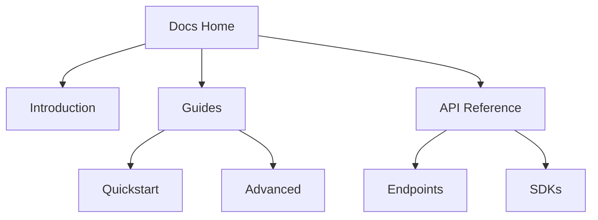

## Overview

Organize your Janek Unon documentation effectively to improve navigation and maintainability. Use page hierarchies for logical structure, tagging systems for quick searches, and version control for tracking changes. Follow these practices to create scalable docs.

<Columns cols={3}>
  <Card title="Page Hierarchies" icon="layout" href="#page-hierarchies">
    Build nested structures for intuitive navigation.
  </Card>
  <Card title="Tagging Systems" icon="tag" href="#tagging-systems">
    Categorize content for better discoverability.
  </Card>
  <Card title="Version Control" icon="git-branch" href="#version-control">
    Manage changes with Git integration.
  </Card>
</Columns>

## Page Hierarchies

Create a clear hierarchy starting with top-level sections like `Introduction`, `Guides`, and `API Reference`. Nest subpages under H2 headings to reflect your project's architecture.



<Steps>
  <Step title="Plan Your Structure" icon="map">
    Outline main categories and subtopics on paper or in a tool like Miro.
  </Step>
  <Step title="Create Top-Level Pages" icon="file">
    Add pages for broad sections using the `New Page` button.
  </Step>
  <Step title="Nest Subpages" icon="folder">
    Drag pages into folders or use sidebar nesting.
  </Step>
</Steps>

<Callout kind="tip">
  Limit nesting to three levels to avoid deep navigation paths.
</Callout>

## Tagging Systems

Tags help users filter content. Apply consistent labels like `feature`, `bugfix`, or `platform:react`.

<Tabs>
  <Tab title="Content Tags" icon="tag">
    Use for categorization:

    | Tag          | Purpose                  | Example Pages      |
    |--------------|--------------------------|--------------------|
    | `feature`    | New functionality       | Dashboard v2      |
    | `bugfix`     | Resolved issues         | Login Flow        |
    | `security`   | Safety updates          | Auth Tokens       |
  </Tab>
  <Tab title="Platform Tags" icon="smartphone">
    Target specific environments:

    - `platform:web`
    - `platform:ios`
    - `platform:android`
  </Tab>
</Tabs>

## Version Control

Integrate Git to track changes across your docs space. Commit frequently and use branches for major updates.

<CodeGroup tabs="Git CLI,Frontend Commands">
  ```bash
  # Initialize repo
  git init

  # Add and commit docs
  git add docs/
  git commit -m "Add initial documentation structure"
  ```
  ```bash
  # From Janek Unon UI
  # Click "Connect Git" > Select repo > Sync changes
  git push origin main
  ```
</CodeGroup>

<Expandable title="Advanced Branching Workflow" default-open="false">
  Use feature branches for docs updates:

  1. `git checkout -b docs-reorg`
  2. Make changes to hierarchies and tags.
  3. `git push origin docs-reorg`
  4. Merge via pull request.

  This keeps your main branch stable.
</Expandable>

<Callout kind="alert">
  Always review changes before merging to prevent broken links or outdated info.
</Callout>

These practices ensure your Janek Unon docs remain organized as your project grows. Start by auditing your current structure and applying one section at a time.