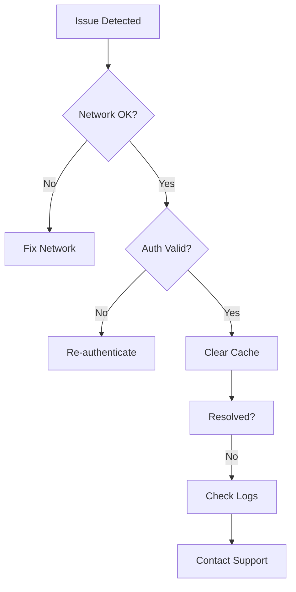

## Overview

Encounter sync errors, sluggish performance, or failed integrations in Janek Unon? This guide provides step-by-step solutions for the most common issues. Follow these instructions to diagnose and fix problems quickly, restoring smooth operation.

<Callout kind="tip">
  Always check the Janek Unon logs first. Access them via the app menu: Help > View Logs.
</Callout>

## Sync Errors

Sync failures often stem from network issues, authentication problems, or corrupted local data. Verify your internet connection and `sync_token` before proceeding.

<Steps>
  <Step title="Verify Network" icon="wifi">
    Open your system network settings and ensure a stable connection. Test by pinging `api.janekunon.com`.
  </Step>
  <Step title="Check Authentication" icon="shield">
    In Janek Unon settings, navigate to Account > Sync. Re-enter your credentials if the `sync_token` shows as expired.
  </Step>
  <Step title="Clear Local Cache" icon="trash-2">
    Go to Settings > Advanced > Clear Sync Cache. Restart the app afterward.
  </Step>
</Steps>

If errors persist, inspect the logs for codes like `SYNC_401`. Use this code snippet to reset sync programmatically:

<CodeGroup tabs="JavaScript,Python">
  ```javascript
  // Reset sync token via API
  const response = await fetch('https://api.janekunon.com/v1/sync/reset', {
    method: 'POST',
    headers: { 'Authorization': `Bearer ${YOUR_SYNC_TOKEN}` }
  });
  ```
  ```python
  # Reset sync token via API
  import requests
  response = requests.post('https://api.janekunon.com/v1/sync/reset',
                          headers={'Authorization': f'Bearer {YOUR_SYNC_TOKEN}'})
  ```
</CodeGroup>

## Performance Issues

Slow loading or lag affects productivity. Common causes include large workspaces or resource contention.

<Tabs>
  <Tab title="macOS" icon="apple">
    <Steps>
      <Step title="Update Janek Unon">
        Open the App Store and install any available updates.
      </Step>
      <Step title="Close Background Apps">
        Use Activity Monitor to quit high-CPU processes.
      </Step>
    </Steps>
  </Tab>
  <Tab title="Windows" icon="monitor">
    <Steps>
      <Step title="Run Disk Cleanup">
        Search for "Disk Cleanup" in the Start menu and clear temporary files.
      </Step>
      <Step title="Disable Startup Items">
        Open Task Manager > Startup tab and disable non-essential apps.
      </Step>
    </Steps>
  </Tab>
</Tabs>

<Callout kind="alert">
  If performance degrades after importing large datasets `{>100MB}`, split files into smaller chunks.
</Callout>

## Integration Failures

Integrations with tools like Slack or GitHub fail due to invalid webhooks or mismatched permissions.

<Columns cols={2}>
  <Card title="Slack Integration" icon="message-circle" href="/docs/integrations/slack">
    Verify webhook URL format: `https://hooks.slack.com/services/YOUR/WEBHOOK`.
  </Card>
  <Card title="GitHub Integration" icon="github" href="/docs/integrations/github">
    Ensure repository permissions allow read/write access.
  </Card>
</Columns>

For webhook debugging, test with this curl command:

```bash
curl -X POST https://hooks.slack.com/services/YOUR/WEBHOOK \
  -H 'Content-type: application/json' \
  -d '{"text": "Test from Janek Unon"}'
```

<Expandable title="Advanced Log Analysis" default-open="false">
  Enable verbose logging in Settings > Debug > Verbose Mode. Search logs for `INT_FAIL` patterns:

  ```
  2024-10-15T10:30:00Z [ERROR] Integration failed: invalid_token for slack
  ```

  Rotate logs weekly to prevent bloat.
</Expandable>

## Quick Diagnosis Flow



Resolve most issues in under 5 minutes using these steps. If problems continue, gather logs and reach out via support@janekunon.com.